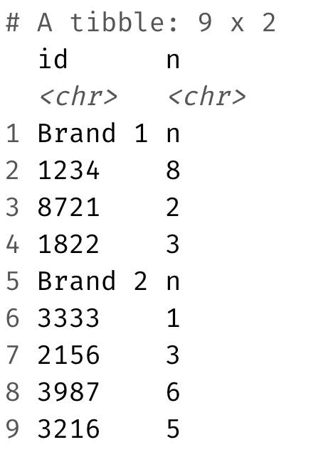

Sales
================
Logun Gunderson

``` r
library(tidyverse)
library(readxl)
```

-   Read in the Excel file called `sales.xlsx` from the `data-raw/`
    folder such that it looks like the following.



``` r
sales <- read_excel("data-raw/sales.xlsx", skip = 3, col_names = c("id", "n"))
```

-   **Stretch goal:** Manipulate the sales data such such that it looks
    like the following.


``` r
sales%>%
  mutate(is_brand_name = str_detect(id, "Brand"),
         brand = if_else(is_brand_name, id, NULL)
         )%>%
  fill(brand)%>%
  filter(!is_brand_name)%>%
  select(brand, id, n)%>%
  mutate(as.numeric(id), as.numeric(n))
```

    ## # A tibble: 7 × 5
    ##   brand   id    n     `as.numeric(id)` `as.numeric(n)`
    ##   <chr>   <chr> <chr>            <dbl>           <dbl>
    ## 1 Brand 1 1234  8                 1234               8
    ## 2 Brand 1 8721  2                 8721               2
    ## 3 Brand 1 1822  3                 1822               3
    ## 4 Brand 2 3333  1                 3333               1
    ## 5 Brand 2 2156  3                 2156               3
    ## 6 Brand 2 3987  6                 3987               6
    ## 7 Brand 2 3216  5                 3216               5
